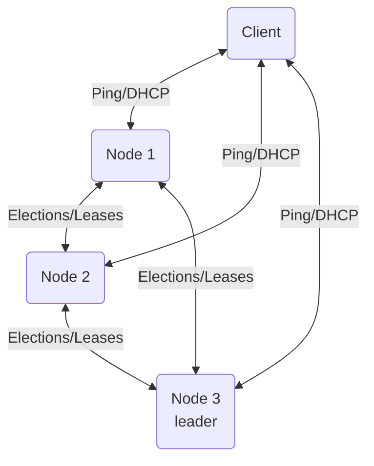

# DHCP Cluster (Group 11)

Project by: Lauri Gustafsson, Juho Röyskö, Vili Sinervä and Simo Soini

## Overview

The project idea is a distributed DHCP cluster, which would provide fault tolerance and geographic distribution as compared to a general DHCP server.
All nodes will run the same software, with leader election to choose a node to make centralized decisions when needed.
The cluster will have a single configuration for the DHCP ranges, with subsets assigned to individual nodes dynamically.
The leases are a shared state between all nodes, which allows the cluster to recover from the loss of a node.
Choosing the best node to connect to will be done by a custom DHCP relay agent.

## Diagram of nodes and client

Primary messages listed for each connection. Leader also sends the range allocations to each node.

## Design details

TODO

## Messages

TODO
