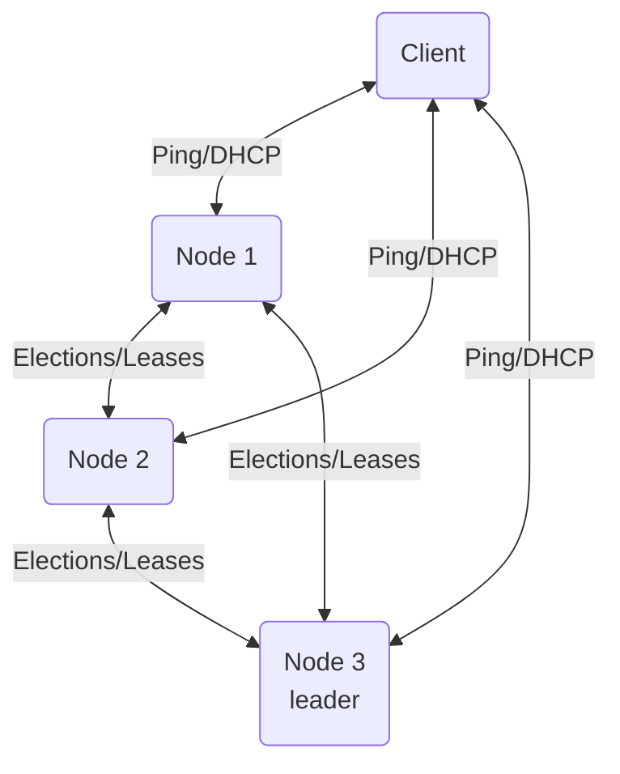

# DHCP Cluster (Group 11)

Project by: Lauri Gustafsson, Juho Röyskö, Vili Sinervä and Simo Soini

## Overview

The project idea is a distributed DHCP cluster, which would provide fault tolerance and geographic distribution as compared to a general DHCP server.
All nodes will run the same software, with leader election to choose a node to make centralized decisions when needed.
The cluster will have a single configuration for the DHCP ranges, with subsets assigned to individual nodes dynamically.
The leases are a shared state between all nodes, which allows the cluster to recover from the loss of a node.
Choosing the best node to connect to will be done by a custom DHCP relay agent.

## Diagram of nodes and client

Primary messages listed for each connection. Leader also sends the range allocations to each node.

## Nodes

## Messages

The order of the messages is not critical for this application. Each lease is granted and updated by a single node, so there is no concurrent access. The timescales that DHCP operates at are in the range of several minutes at least. The bully algorithm also works without a strict ordering of messages. We also don't need to worry about clocks being out of sync, as long as all nodes are using an NTP server. The exactness of the expiry timestamps is not critical.

### Leader election (bully algorithm)

These messages are very simple and don't have much of a syntax. They are sent between all nodes as necessary. The meanings of the messages are as they are in the generic bully algorithm.
- Election
- Okay
- Coordinator

### Client-Server

- PING (ICMP echo) - used for RTT estimation, which the client uses to select the node to connect to. Use the existing implementation, instead of writing our own.
- DHCPDISCOVER, DHCPOFFER, DHCPREQUEST, DHCPACK, DHCPNACK - these are standard DHCP messages, so are not explained further here. Might use an existing implementation/library.

### Custom

The format of these message is a serialized binary representation of Rust enums/structs.
- Add/Update lease messages (two separate message types) sent every time a lease is added or updated. If one is not sent at least every X seconds, an empty one is sent as a heartbeat. The heartbeat is used to detect missing nodes. These messages are multicast to all nodes. We expect traffic to be low enough that sending each update individually should not be a problem. This includes at least the MAC address, IP address and expiry timestamp.
- DHCP range allocations are sent by the leader to every other node individually when necessary (leader changes, a node is running out of addresses, a node is dropped etc). This makes sure the DHCP range is fully utilized without overlap. This includes the starts and lengths of the ranges that the node allocates from.
- DHCP config is multicast to all nodes by the leader when a leader is elected. This makes sure that all nodes are using the same version of the configuration, even if one has an outdated local copy of the configuration file.
- Cluster status is a simple message which the leader uses to let the other nodes know, if the cluster has the majority required to continue operating.
