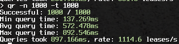

## 2024-12-09

Today we got the server to react to client requests in a reasonable manner,
e.g. find and refresh, or create a new lease, and then reply to the client.

Some bugs had to be ironed out (also in the client), but the project is ready
to be demoed next wednesday!

There is a laundry list of stuff that can still be polished (currently only in
our Discord), and those should probably be converted to GitHub issues and
resolved eventually.

## 2024-12-10

We got the server to run on three separate nodes over the Internet.
It wasn't trivial, there were (and are) still some bugs in the server code.

Regardless, this is a milestone achievement for the project, and fulfillment of
course grading criteria as well.

A demo video was recorded, which can be viewed in the [README](../README.md).

Remaining bugs and improvement ideas were documented in [Issues](https://github.com/hy-ds-group-11/dhcpcluster/issues).

## 2024-12-15

The abovementioned issues list got shorter during the rest of the week.
Major changes include:
- Multithreaded test client
  - 1000s of leases per second!
- Free lease search optimization
  - Still using linear search, no reason not to
- Lots and lots of error handling, prettier logging and less panics
  - UI code was detached from the main thread using a channel
- Code refactoring and cleanup
  - Very strict linter settings enabled
- Configuration file format was refactored
  - Units are now suffixed to field names where applicable
  - Structure was added
- Added a GitHub actions workflow that builds [releases](https://github.com/hy-ds-group-11/dhcpcluster/releases) for all major platforms!

The prototype version (without real DHCP) is nearly completed now, the recent
releases could be described as "alpha releases". We're proud of our work.
Using Rust and working in an agile team with pair- and mob programming was a great experience,
these tools and practices were a good fit for a project like this.
